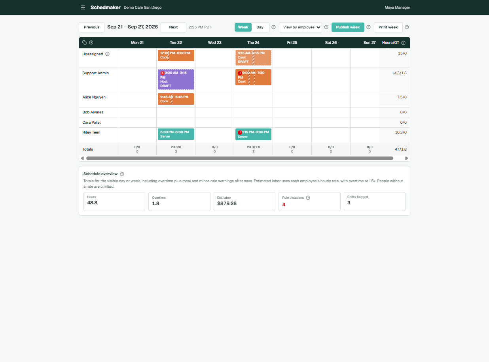
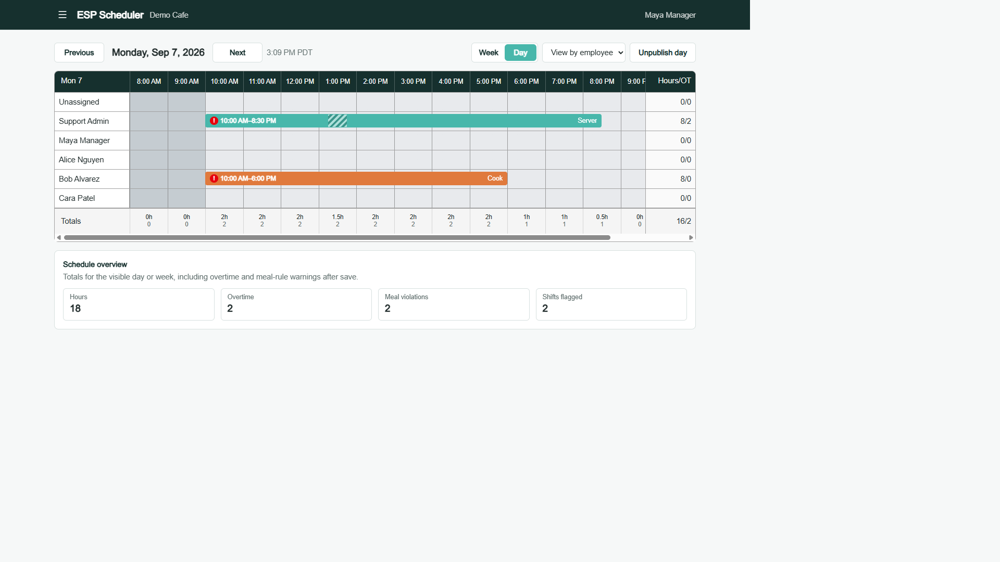
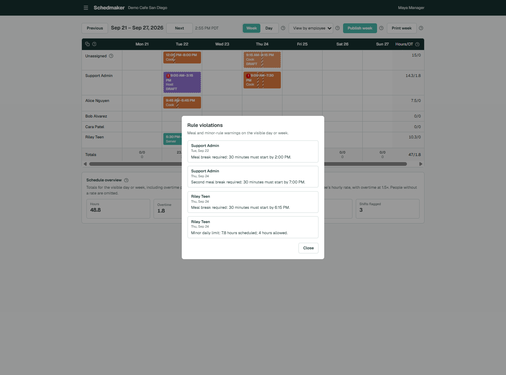
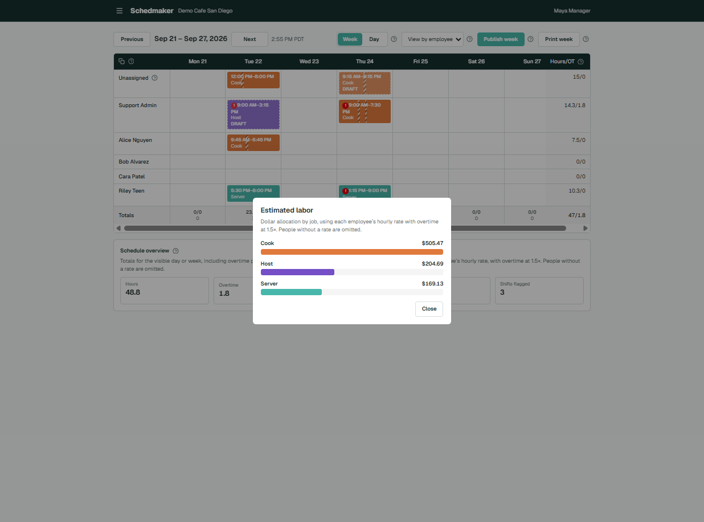
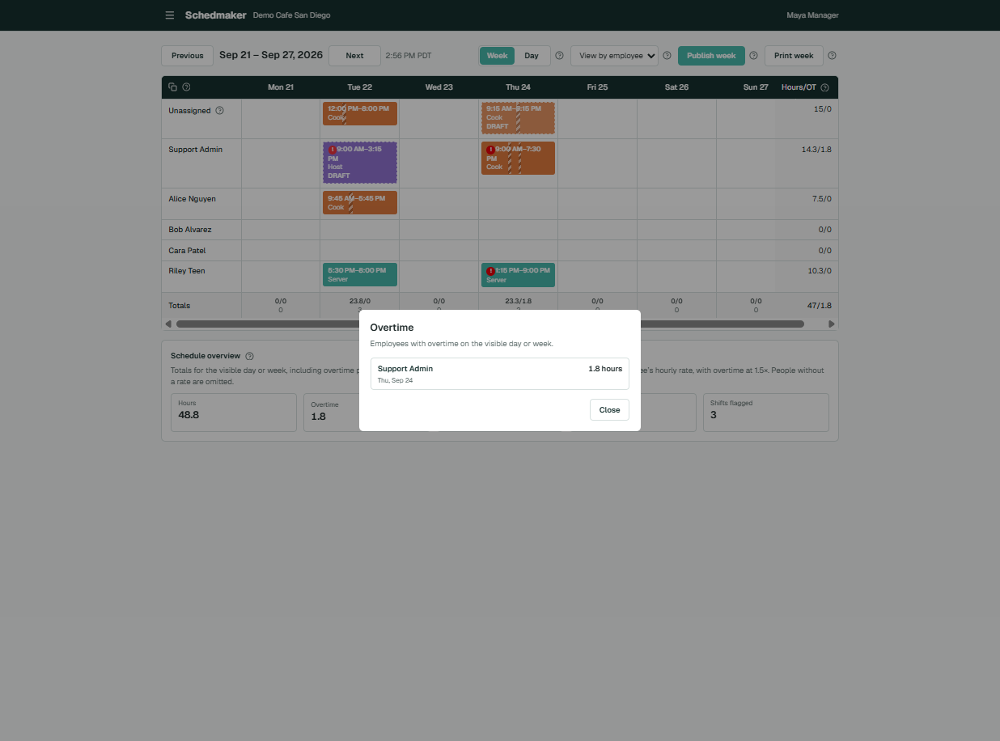
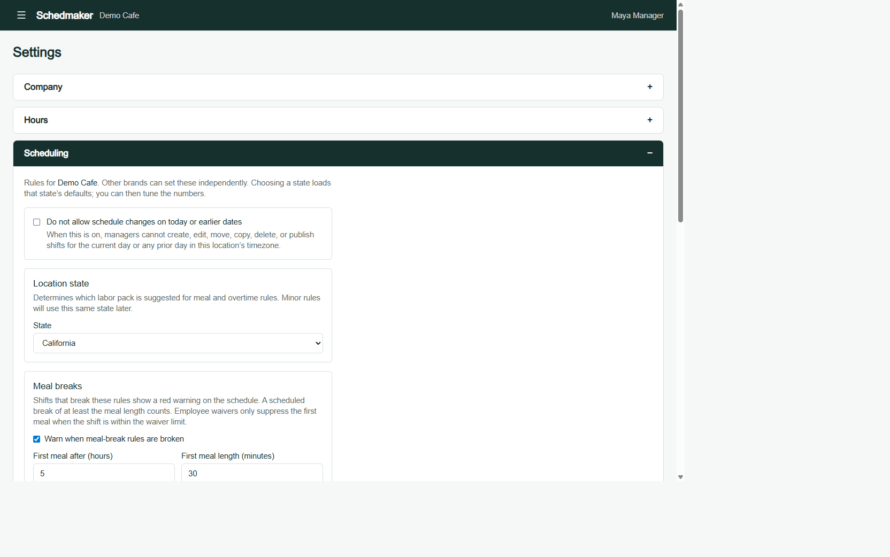
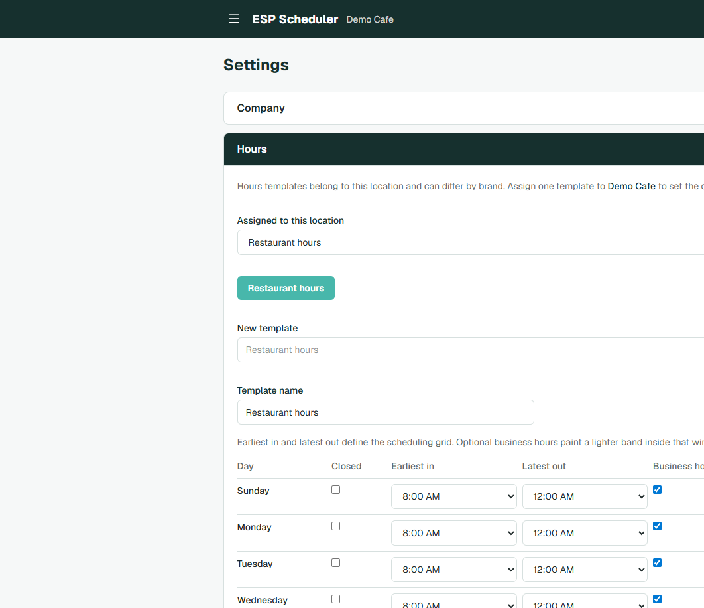
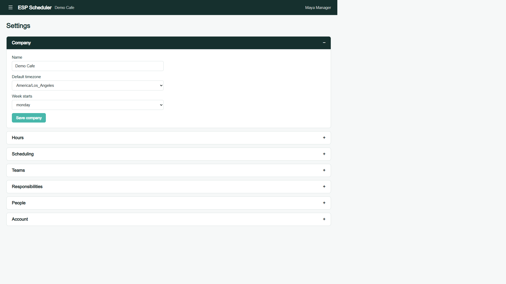
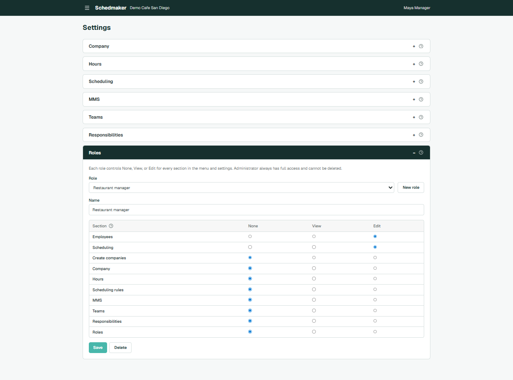

# Schedmaker

Employee scheduling for restaurants, retail, and other shift-based teams. Build a week or a single day on a 15-minute grid, assign jobs and breaks, and see meal-break warnings and overtime as you go.

The app lives in [`web/`](web/). It is released under the [MIT License](LICENSE).

## Features

### Week and day calendars

Managers work from a team calendar with **Week** and **Day** views. Navigate with Previous/Next, jump by URL (`?view=week|day&date=YYYY-MM-DD`), and switch **View by employee** or **View by job**.

- Shifts snap to a **15-minute grid** (96 slots per day, including a midnight end).
- Each bar shows start/end time and the **job name**, color-coded by job.
- **Unassigned** is a first-class row so open shifts stay visible.
- Publish or unpublish a day or an entire week in one action.
- Employee and manager login, iCal feeds, and weekly schedule MMS on publish
- Copy last week or last week same day of week and replace current day schedule

### Hours, overtime, and labor overview (overtime rules by state California default)

The calendar is built for estimated labor cost, hours, and coverage.

- Sticky **Hours/OT** totals per person (or job) and per day.
- Day view adds a per-hour footer so you can see who is on the floor at 2:00 PM.
- On-clock time subtracts scheduled breaks.
- The **Schedule overview** panel sums hours, overtime, meal violations, and flagged shifts for the visible range.
- Overtime uses the location’s rules: daily after 8, double after 12, weekly after 40, and optional seventh-day overtime (California defaults). Weekly OT is computed from the full workweek even when you are looking at a single day.
- Estimated labor uses one rate per shift. An **Override Hourly Rate** above $0.00 replaces the job rate. Otherwise the shift uses that job’s **default hourly rate** when it is above $0.00. A blank or $0.00 override means “use the job rate.” Shifts with neither rate add hours but no dollars. Overtime is 1.5× whichever rate applies.
- Hours worked at another restaurant count toward daily and weekly overtime on the schedule you are looking at. Those other-restaurant shifts stay out of this store’s labor dollars.

### Meal-break warnings - California break support and multi state support

When meal rules are on, shifts that miss a required meal show a red **!** on the card. Hover the icon for the reason.

- First meal after 5 hours, 30 minutes, must start by the end of the 5th hour; waivable if the shift is 6 hours or less.
- Second meal after 10 hours; waivable up to 12 hours only if the first meal was taken.
- A scheduled break of at least the meal length counts as that meal.
- Adjacent breaks (one ends when the next starts) are allowed; overlapping breaks are rejected.
- Per-employee **first meal-break waiver** suppresses the first-meal warning when the shift is within the waiver window.

Warnings are visual. They do not block save, so you can still post a non-compliant schedule when you need to.

### Shift editing

Click a shift or an empty cell to create or edit.

- Worker, job, date, start/stop on the 15-minute grid.
- Multiple breaks per shift, shown as a hatch on the bar.
- Copy a shift to another day.
- A person cannot be booked on two overlapping shifts.
- Optional **historical lock**: when enabled, today and earlier dates cannot be created, moved, copied, deleted, or published.

### Jobs and pay

Each job on a team can have a **default hourly rate**. On the employee, **Override Hourly Rate** is optional and wins only when it is above $0.00.

- The home store assigns jobs from that company’s list. One job is **primary**. Saving jobs with none marked primary is rejected.
- A new shift defaults to the primary job. The job list is only jobs assigned to that person. Someone with no assigned job does not appear on the week or day schedule and cannot be placed on a shift.
- An open shift can still have no job. Copy week keeps the job when the person is still assigned to it, otherwise it uses their primary job.

### Loaning employees

Every person has one **home store**. The home store can loan them to other companies with **Loaned to**. A loan puts them on that store’s schedule without adding a directory role there.

- At the loaned store their name has a black circle with a white **L**. Hover shows “Loaned from {home store}.”
- Their job list is the jobs assigned at the home store, including the primary job. Pay uses the home store’s override rate.
- Shifts they work at another restaurant show on this calendar in light grey, with the time and the other company’s name. Those cards are view-only: they are not opened, dragged, edited, or copied.
- Meal, minor, and overtime rules are the rules of the restaurant on the screen. The person’s meal-break waiver and birth date still come from the home store. Grey shifts are included when calculating overtime and minor limits for the week, and the on-screen restaurant’s own shifts pick up the overtime share. Meal warnings stay on each local shift.

### Employee loan management

**Employee loans** sits in the menu between Company settings and My account. It is available to Administrators and to anyone whose role can edit Company settings.

- The list is everyone currently loaned out from a store you can administer: name, home store, and each destination.
- **Change** replaces that person’s full set of loans. **Remove** ends one destination. When the last destination is removed, they leave the list.
- Only the home store can change loans. A loan cannot point at the home store, and a store where the person already has a directory entry is not a loan.

### Hours templates

Each location can assign an hours template that shapes the day-view grid.

- **Earliest in / latest out** set the scheduling window (for example 8:00 AM–midnight).
- Optional **business hours** paint a lighter band inside that window (for example 10:00 AM–10:00 PM).
- Closed days, copy Monday to all days, and per-location assignment so brands can differ.

### People, teams, and jobs

- Directory of employees with team membership and admin flags.
- **Deactivate** hides someone from the schedule picker and People settings without deleting their history. Existing shifts stay on the calendar as **Unassigned**.
- **Show deactivated** is off by default (`?deactivated=1` to review).
- You cannot deactivate yourself.
- Teams have their own timezone, week start, color, and jobs (Server, Cook, Host, …).
- Responsibilities are a company-level duty list you can maintain alongside the schedule.

### Company and account

Settings:

| Section | What it covers |
| --- | --- |
| Company | Name, default timezone, week-start day |
| Hours | Templates and the location’s assigned window |
| Scheduling | Historical lock, US state, meal rules, overtime rules |
| Teams | Team identity, jobs, colors, and each job’s default hourly rate |
| Responsibilities | Shared duties |
| People | Directory, home store, jobs, override hourly rate, loans, and who manages other stores |
| Account | Name, email, phone, password, and a personal **iCal** feed |
| Roles | Role based permissions for all the features of the schedule app |

Choosing a US state loads that state’s meal and overtime defaults (California is first). You can then tune the numbers. Minor hour and curfew rules are next.

### Access and notifications

- Sign up, login, activation links, and password reset via Auth.js.
- Company admins manage people and settings; workers see their own schedule context.
- Email (Mailgun) is optional. Weekly schedule MMS is configured per company in Settings → MMS (Twilio). If MMS is off, publish messages print to the server console.

## Quick start

```bash
cd web
cp .env.example .env
npm install
npx prisma migrate deploy
npx prisma db seed
npm run dev
```

Open [http://localhost:3000](http://localhost:3000).

| Role | Email | Password |
| --- | --- | --- |
| Manager | `manager@schedmaker.local` | `scheduler123` |
| Support | `support@schedmaker.local` | `scheduler123` |

Set `DATABASE_URL` to your Postgres instance and generate `AUTH_SECRET`. The seed targets the `scheduler` database as `schedUser`. `npx prisma migrate deploy` does not need `CREATEDB` for a shadow database.

Optional disposable Postgres on port 5433:

```bash
docker compose up -d
```

## Stack

- [Next.js](https://nextjs.org/) App Router and React
- [PostgreSQL](https://www.postgresql.org/) with [Prisma](https://www.prisma.io/)
- [Auth.js](https://authjs.dev/) sessions
- Tailwind CSS

---

## Screenshots

### Week view

People down the side, days across the top, Hours/OT on the right, and a labor overview under the grid. Meal-rule warnings appear as a red mark on the shift.



### Day view

A 15-minute timeline with grey hours-template bands, compact shift bars, and per-hour totals along the bottom.



### Rule Warnings Described



### Estimated labor breakdown by job $

Dollars use the job’s default hourly rate, or the employee’s override when that override is above $0.00.



### Overtime scheduled view



### Scheduling settings

Location state, meal-break thresholds, overtime rules, and the optional lock on historical dates.



### Hours templates

Earliest in, latest out, and optional business hours for each day of the week.



### Company settings

Name, default timezone, and the day the workweek starts.



### Role configuration

None, View, or Edit for each section, including the ability to create companies.



---

Schedmaker is an [MIT-licensed](LICENSE) project. It started from [Staffjoy](https://github.com/Staffjoy/v2), the open-source employee scheduler created by StaffJoy, Inc.
